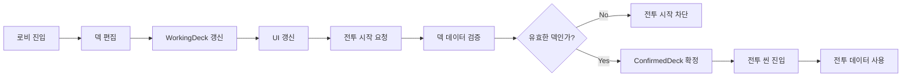
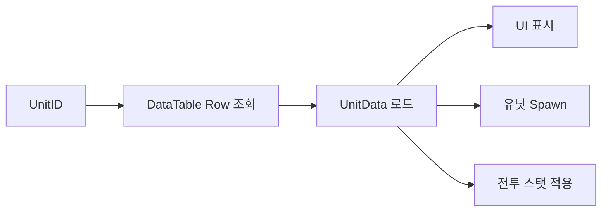

# CoreClave

> Unreal Engine 기반 3D 턴제 전략 카드 게임  
> 덱 구성, 유닛 배치, 턴 기반 전투, 데이터 기반 확장 구조를 구현했습니다.

<br/>

<p align="center">
  
</p>

<br/>

---

## 목차

- [프로젝트 소개](#프로젝트-소개)
- [시스템 흐름도](#시스템-흐름도)
- [핵심 구현 요약](#핵심-구현-요약)
- [프로젝트 화면](#프로젝트-화면)
- [1. 로비-전투 데이터 흐름 설계](#1-로비-전투-데이터-흐름-설계)
- [2. DataTable 기반 유닛 확장 구조](#2-datatable-기반-유닛-확장-구조)
- [기타 구현 기능](#기타-구현-기능)
- [핵심 성과](#핵심-성과)
- [프로젝트를 통해 배운 점](#프로젝트를-통해-배운-점)

<br/>

---

## 프로젝트 소개

**CoreClave**는 Unreal Engine으로 제작한 **3D 턴제 전략 카드 게임**입니다.  
플레이어는 로비에서 덱을 구성하고, 전투에 진입해 카드와 유닛을 활용하여 턴 단위의 전략 전투를 진행합니다.

이 프로젝트는 1인 개발로 진행했으며, 단순히 전투 기능을 구현하는 것보다  
**덱 데이터가 로비에서 전투까지 안정적으로 이어지는 구조**와  
**새로운 유닛을 쉽게 추가할 수 있는 데이터 기반 설계**에 중점을 두었습니다.

| 항목 | 내용 |
|---|---|
| 프로젝트명 | CoreClave |
| 장르 | 3D 턴제 전략 카드 게임 |
| 개발 기간 | 개발 진행 중 |
| 엔진 | Unreal Engine 5.5 |
| 언어 | C++ / Blueprint |
| 개발 형태 | 1인 개발 |
| 주요 구현 | 덱 구성, 턴제 전투, 유닛 배치, DataTable 구조 |

<br/>

<br/>

---

## 시스템 흐름도

CoreClave는 **1:1 대전 게임**을 목표로 구상한 프로젝트이기 때문에, Unreal Engine의 **Listen Server 구조**를 기준으로 로비와 전투 흐름을 설계했습니다.  
Host는 서버이자 플레이어로 동작하고, Client는 Host가 생성한 세션에 접속하는 방식으로 게임 흐름을 구성했습니다.

로비에서는 각 플레이어가 자신의 덱을 구성하고, 전투 시작 요청이 들어오면 덱 크기와 CardID 유효성을 검증한 뒤 전투 씬으로 진입하도록 설계했습니다.  
전투에서는 카드 선택, 유닛 배치, 턴 진행, 전투 결과 처리가 서버 기준의 Match State 흐름으로 연결되도록 구조를 나누었습니다.

이를 통해 로비에서는 빠른 UI 반응성을 유지하고, 전투에서는 서버가 검증한 데이터만 사용하도록 하여 1:1 대전 환경에서 데이터 불일치가 발생하지 않도록 설계하고자 하였습니다.

<p align="center">
  
</p>

<br/>

---

## 핵심 구현

CoreClave는 로비에서 덱을 구성하고, 검증된 덱 데이터를 기반으로 전투에 진입하는 구조로 설계했습니다.  
전투에서는 카드 선택, 유닛 배치, 턴 진행, UI 갱신이 하나의 흐름으로 연결되며, 유닛 정보는 DataTable을 기준으로 관리됩니다.

<br/>

<table>
  <tr>
    <td align="center" width="50%" valign="top">
      <b>Deck & Battle Flow</b><br/>
      <sub>로비 덱 데이터를 전투 씬까지 유지하고, 전투 시작 전 검증하는 구조</sub>
      <br/><br/>
      
    </td>
    <td align="center" width="50%" valign="top">
      <b>Data-Driven Unit System</b><br/>
      <sub>유닛 정보를 DataTable에서 관리하여 Row 추가 중심으로 확장</sub>
      <br/><br/>
      
    </td>
  </tr>
  <tr>
    <td align="center" width="50%" valign="top">
      <b>Turn-Based Battle</b><br/>
      <sub>카드 선택, 유닛 배치, 이동, 공격 흐름을 턴 상태에 따라 처리</sub>
      <br/><br/>
      
    </td>
    <td align="center" width="50%" valign="top">
      <b>UI & Feedback</b><br/>
      <sub>덱 편집 UI, 전투 카드 UI, 유닛 정보 UI 구성</sub>
      <br/><br/>
      
    </td>
  </tr>
</table>

<br/>

---

# 1. 로비-전투 데이터 흐름 설계

> 로비에서 편집한 덱 데이터와 전투에서 사용할 확정 데이터를 분리하여,  
> UI 반응성과 전투 데이터 안정성을 함께 고려한 구조입니다.

<br/>

## 문제 상황

CoreClave는 로비에서 덱을 구성한 뒤 전투 씬으로 진입하는 구조입니다.  
이때 로비에서 편집 중인 덱 데이터가 전투 시작 시점까지 유지되어야 하고,  
전투에서 사용할 수 있는 유효한 데이터인지 검증하는 과정이 필요했습니다.

초기 구조에서 덱 편집 데이터와 전투 데이터가 명확히 분리되지 않으면,  
UI에 표시되는 덱과 실제 전투에서 사용하는 덱이 어긋날 수 있었습니다.

<br/>

```text
필요했던 구조
- 로비에서는 빠르게 덱을 편집할 수 있어야 함
- 덱 변경 시 UI가 즉시 갱신되어야 함
- 전투 시작 전 덱 크기와 CardID 유효성을 검증해야 함
- 검증된 덱 데이터만 전투 씬에서 사용되어야 함
```

<br/>

---

## 해결 방향

로비에서 편집 중인 덱은 `GameInstanceSubsystem`에서 관리하도록 구성했습니다.  
`GameInstanceSubsystem`은 레벨 전환 이후에도 유지되기 때문에, 로비에서 구성한 덱 데이터를 전투 씬까지 전달하기에 적합했습니다.

전투 시작 시점에는 현재 편집 중인 덱을 바로 사용하지 않고,  
덱 크기와 카드 ID 유효성을 검증한 뒤 전투용 데이터로 확정하는 흐름으로 분리했습니다.

<br/>



<br/>

---

## 구현 구조

| 구분 | 처리 방식 |
|---|---|
| 편집 데이터 | `WorkingDeck`에서 관리 |
| 확정 데이터 | 검증 후 `ConfirmedDeck`으로 분리 |
| 데이터 유지 | `GameInstanceSubsystem` 사용 |
| UI 갱신 | 덱 변경 시 UI 갱신 이벤트 호출 |
| 전투 검증 | 덱 크기, CardID, DataTable Row 유효성 확인 |

<br/>

<details>
<summary>핵심 코드 예시</summary>

```cpp
USTRUCT(BlueprintType)
struct FDeckCardEntry
{
    GENERATED_BODY()

    UPROPERTY(EditAnywhere, BlueprintReadWrite)
    FName CardID;

    UPROPERTY(EditAnywhere, BlueprintReadWrite)
    int32 Count = 1;
};
```

```cpp
bool UDeckBuilderSubsystem::ValidateDeck() const
{
    int32 TotalCount = 0;

    for (const FDeckCardEntry& Entry : WorkingDeck)
    {
        TotalCount += Entry.Count;

        if (Entry.CardID.IsNone())
        {
            return false;
        }

        const FCardData* CardData =
            CardDataTable->FindRow<FCardData>(
                Entry.CardID,
                TEXT("ValidateDeck")
            );

        if (!CardData)
        {
            return false;
        }
    }

    return TotalCount <= MaxDeckSize;
}
```

```cpp
void UDeckBuilderSubsystem::RequestStartBattle()
{
    if (!ValidateDeck())
    {
        return;
    }

    ConfirmedDeck = WorkingDeck;

    // Battle Level 이동 또는 전투 초기화 진행
}
```

</details>

<br/>

---

## 결과

로비에서는 사용자가 덱을 빠르게 편집할 수 있고,  
전투 시작 시점에는 검증된 덱 데이터만 사용할 수 있도록 구조를 분리했습니다.

이를 통해 UI 표시용 데이터와 실제 전투 데이터가 섞이지 않도록 관리할 수 있었고,  
Listen Server 구조에서도 전투 상태를 서버 기준으로 처리할 수 있는 기반을 마련했습니다.

<br/>

| 항목 | 결과 |
|---|---|
| 덱 편집 | 로비에서 즉시 반영 |
| 데이터 유지 | 레벨 전환 후에도 덱 데이터 유지 |
| 전투 검증 | 유효한 덱만 전투 진입 |
| 구조 분리 | 편집 데이터와 확정 데이터 분리 |
| 확장성 | Listen Server 구조를 고려한 전투 데이터 흐름 설계 |

<br/>

---

# 2. DataTable 기반 유닛 확장 구조

> 유닛 정보를 코드에 직접 작성하지 않고 DataTable에서 관리하여,  
> 신규 유닛을 쉽게 추가하고 밸런스를 조정할 수 있도록 설계했습니다.

<br/>

## 문제 상황

턴제 전략 카드 게임에서는 유닛의 종류가 늘어날수록 관리해야 할 데이터가 많아집니다.  
체력, 공격력, 이동 범위, 비용, 아이콘, 유닛 클래스 같은 정보를 코드나 개별 Blueprint에 직접 작성하면,  
유닛이 추가될 때마다 수정해야 하는 위치가 많아지고 데이터가 중복될 수 있습니다.

<br/>

```text
문제점
- 유닛별 스탯을 개별 Blueprint에 작성하면 관리가 어려움
- UI 표시 데이터와 전투 데이터가 중복될 수 있음
- 신규 유닛 추가 시 코드 수정이 반복됨
- 밸런스 조정 시 여러 위치의 데이터를 함께 수정해야 함
```

<br/>

---

## 해결 방향

유닛 데이터를 `FTableRowBase` 기반 구조체로 정의하고, DataTable에서 Row 단위로 관리했습니다.  
카드나 유닛은 `UnitID`를 기준으로 DataTable Row를 조회하고,  
조회한 데이터를 UI 표시, 유닛 Spawn, 전투 스탯 적용에 공통으로 사용했습니다.

<pr>
  
</pr>

<br/>



<br/>

---

## 구현 구조

| 데이터 | 사용 위치 |
|---|---|
| DisplayName | 카드 UI, 유닛 정보 UI |
| MaxHP | 전투 유닛 체력 |
| Attack | 공격 처리 |
| MoveRange | 이동 가능 범위 계산 |
| Cost | 카드 사용 비용 |
| UnitClass | 유닛 Spawn |
| Icon | 카드 / 유닛 UI |

<br/>

<details>
<summary>핵심 코드 예시</summary>

```cpp
USTRUCT(BlueprintType)
struct FUnitData : public FTableRowBase
{
    GENERATED_BODY()

    UPROPERTY(EditAnywhere, BlueprintReadWrite)
    FName UnitID;

    UPROPERTY(EditAnywhere, BlueprintReadWrite)
    FText DisplayName;

    UPROPERTY(EditAnywhere, BlueprintReadWrite)
    int32 MaxHP = 0;

    UPROPERTY(EditAnywhere, BlueprintReadWrite)
    int32 Attack = 0;

    UPROPERTY(EditAnywhere, BlueprintReadWrite)
    int32 MoveRange = 0;

    UPROPERTY(EditAnywhere, BlueprintReadWrite)
    int32 Cost = 0;

    UPROPERTY(EditAnywhere, BlueprintReadWrite)
    TSubclassOf<AActor> UnitClass;

    UPROPERTY(EditAnywhere, BlueprintReadWrite)
    TObjectPtr<UTexture2D> Icon;
};
```

```cpp
const FUnitData* UUnitDataManager::FindUnitData(const FName& UnitID) const
{
    if (!UnitDataTable || UnitID.IsNone())
    {
        return nullptr;
    }

    return UnitDataTable->FindRow<FUnitData>(
        UnitID,
        TEXT("FindUnitData")
    );
}
```

```cpp
AUnitBase* UBattleUnitSpawner::SpawnUnitByID(
    const FName& UnitID,
    const FVector& SpawnLocation
)
{
    const FUnitData* UnitData = UnitDataManager->FindUnitData(UnitID);

    if (!UnitData || !UnitData->UnitClass)
    {
        return nullptr;
    }

    AUnitBase* SpawnedUnit = GetWorld()->SpawnActor<AUnitBase>(
        UnitData->UnitClass,
        SpawnLocation,
        FRotator::ZeroRotator
    );

    if (SpawnedUnit)
    {
        SpawnedUnit->InitializeFromData(*UnitData);
    }

    return SpawnedUnit;
}
```

</details>

<br/>

---

## 결과

DataTable을 기준으로 유닛 정보를 관리하면서,  
UI 표시 데이터와 실제 전투 데이터가 같은 원본을 참조하도록 만들었습니다.

신규 유닛을 추가할 때 코드나 Blueprint 구조를 반복해서 수정하지 않고,  
DataTable Row를 추가하는 방식으로 확장할 수 있게 되었습니다.

<br/>

| 항목 | 결과 |
|---|---|
| 데이터 관리 | 유닛 정보를 DataTable Row로 통합 관리 |
| 중복 제거 | UI와 전투 로직이 동일한 UnitData 참조 |
| 확장성 | 신규 유닛 추가 시 Row 추가 중심으로 확장 |
| 유지보수 | 밸런스 수치 변경 시 DataTable 수정으로 반영 |
| 구조화 | UnitID 기반으로 카드, UI, 스폰, 전투 로직 연결 |

<br/>

---

# 기타 구현 기능

## 턴제 전투 흐름

플레이어 턴과 적 턴을 구분하고, 턴 상태에 따라 카드 사용, 유닛 이동, 공격 가능 여부를 제어했습니다.


<br/>

## 카드 기반 유닛 배치

카드를 선택하면 해당 카드가 참조하는 `UnitID`를 기준으로 유닛 데이터를 조회하고,  
전투 필드의 유효한 위치에 유닛을 배치하도록 구현했습니다.

| 처리 단계 | 내용 |
|---|---|
| 카드 선택 | 사용할 카드 선택 |
| 비용 확인 | 현재 자원과 카드 비용 비교 |
| 위치 확인 | 배치 가능한 타일인지 검사 |
| 유닛 생성 | UnitID 기반 유닛 Spawn |
| 데이터 적용 | DataTable에서 조회한 스탯 적용 |

<br/>

## 전투 UI

전투 중 필요한 정보를 확인할 수 있도록 카드 목록, 현재 턴, 선택된 유닛 정보, 자원 상태를 UI로 표시했습니다.

| UI 요소 | 설명 |
|---|---|
| 카드 목록 | 사용 가능한 카드 표시 |
| 턴 표시 | 현재 턴 상태 출력 |
| 유닛 정보 | 선택된 유닛의 HP, 공격력, 이동 범위 표시 |
| 자원 정보 | 카드 사용에 필요한 비용과 현재 자원 표시 |

<br/>

---

# 핵심 성과

| 항목 | 결과 |
|---|---|
| 로비-전투 데이터 흐름 | GameInstanceSubsystem 기반 데이터 유지 |
| 덱 검증 | 전투 진입 전 덱 크기와 CardID 유효성 검증 |
| 구조 분리 | WorkingDeck과 ConfirmedDeck 분리 |
| Listen Server 대응 | 전투 상태를 서버 기준으로 처리할 수 있는 구조 설계 |
| 유닛 데이터 관리 | DataTable Row 기반 통합 관리 |
| 확장성 | 신규 유닛 추가 시 Row 추가 중심으로 확장 |
| 유지보수성 | UI, 스폰, 전투 로직이 동일한 UnitData 참조 |

<br/>

---

# 프로젝트를 통해 배운 점

CoreClave를 개발하면서 게임 클라이언트 구조에서 **데이터 흐름을 명확하게 분리하는 것**이 중요하다는 점을 경험했습니다.  
로비에서 편집하는 데이터와 실제 전투에서 사용할 데이터를 구분하지 않으면, UI 상태와 게임 진행 데이터가 쉽게 어긋날 수 있음을 확인했습니다.

또한 DataTable 기반 유닛 관리 구조를 구현하면서, 데이터를 코드에 직접 작성하는 방식보다  
공통 데이터 원본을 두는 방식이 확장성과 유지보수에 더 유리하다는 것을 배웠습니다.

<br/>

---

# License

본 프로젝트는 포트폴리오 목적으로 정리되었습니다.
